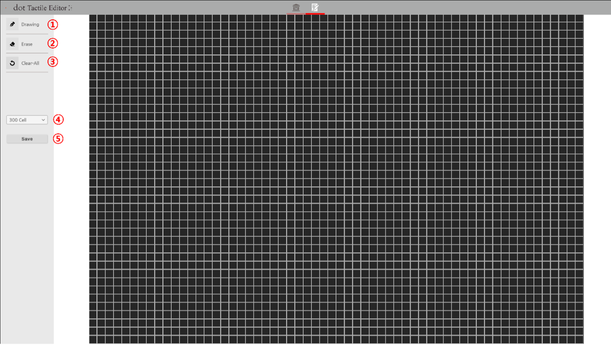
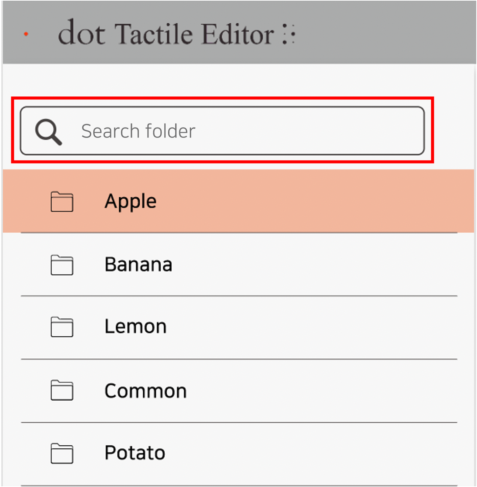
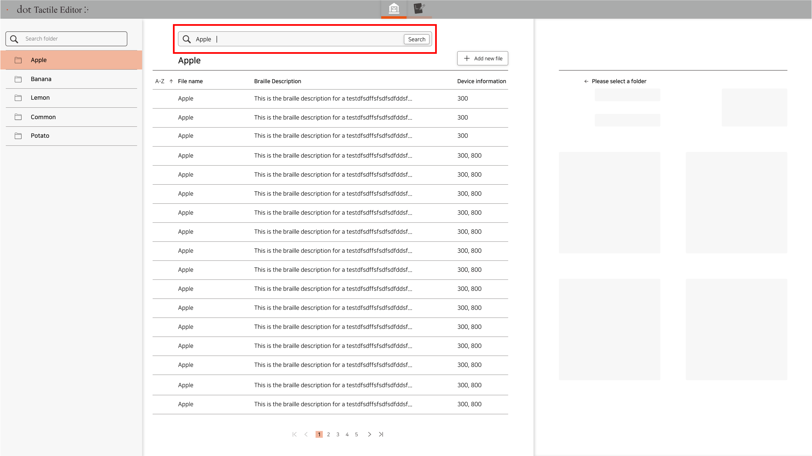
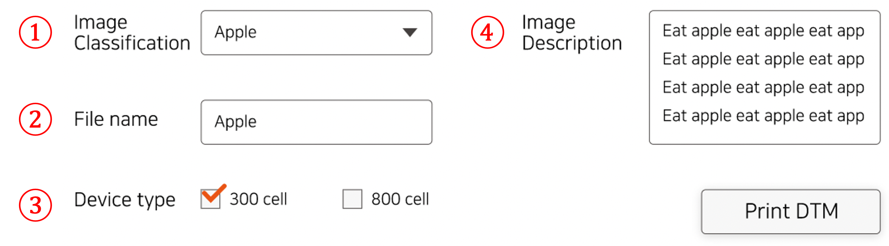
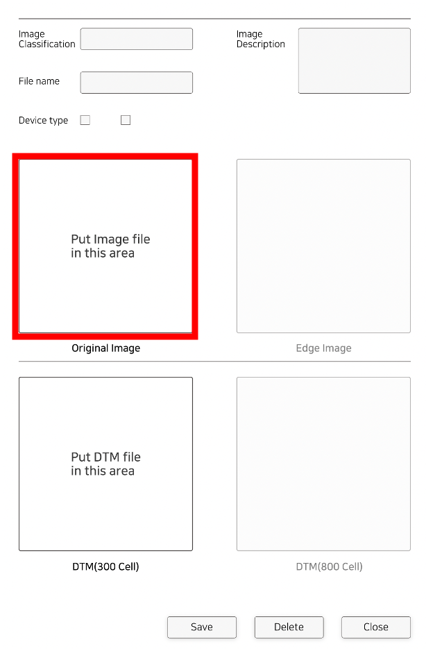
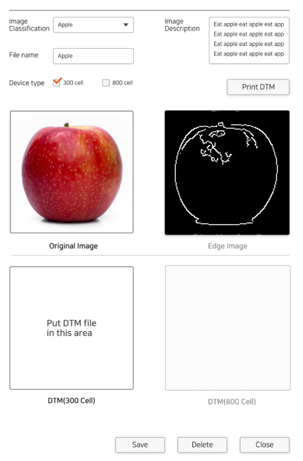
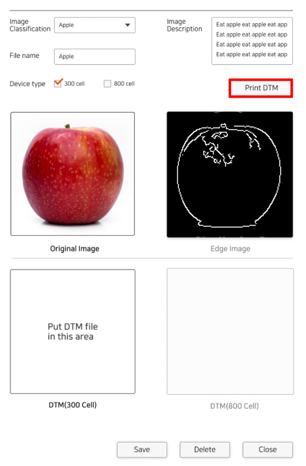

# About
What is DTM?   
DTM stands for Dot Tactile Map, and it is a file that stores tactile graphic data for the Dot Pad.   
The DTM Editor (dot Tactile Editor) is used to create and edit DTM files.

# Screen

### Library

   

- Group List Area   
This shows the parent groups. You can navigate to sub groups by clicking, and you can also find groups using the search bar.   

- DTM List Area   
The DTM list of the selected group is displayed in this area. If you select a DTM file, the selected DTM will be displayed in the DTM Edit Area.   
By clicking the ***Add new file*** button, you can add a new DTM entry.   

- DTM Edit Area   
You can add, edit, or delete DTM entries.

### Editor

The editor has functions allowing you to create new DTM entries or edit existing ones by changing individual cells of the DTM.   
   
The cell count on the screen is automatically adjusted based on the DTM Device type as selected from the library.   

- Screen Layout   
The buttons on the left side of the screen are used when editing the cells on the right side of the screen.   
    ① Drawing: for drawing on the cell area   
    ② Erase: for erasing drawn cells   
    ③ Clear-All: for erasing all existing drawings   
    ④ Device Type combo box: for selecting the desired DTM Device   
    ⑤ Save: for saving work and returning to the previous screen   

# Features

### Group Search

   
You can search for groups using the search bar above the Group List Area.

### DTM Search

   
You can search for DTMs using the search bar above the DTM List Area.   
Some keywords include the DTM name, device type, etc.

### Adding New Entries

(1) Add New Entry   
On the upper right corner of the DTM List Area, click the ***Add new file*** button to create a new template.   
   

(2) Enter DTM Details  
   
- Image Classification: DTM group
- File name: DTM name
- Device type: the Dot Pad device type for the DTM
- Image Description: explanation of DTM

(3) Select an Image to Convert to DTM   
As in the image below, select the "Original Image" area and choose the image file to be converted.   
Once image selection is complete, you will see the chosen image and its outline in the "Original Image" and "Edge Image" area, respectively.   
   

(4) Convert to DTM   
Click the ***Print DTM*** button to create a DTM file compatible with the selected device type.   
   
If the DTM conversion is successful, there will be a DTM image output in the box of the corresponding device type.   

(5) Save   
Click the ***Save*** button on the lower right corner of the DTM Edit Area to save your work.   

### Editing Existing Files

   
Clicking the desired file from the DTM List Area will open it up on the DTM Edit Area.   
① Clicking DTM(300 Cell) will open an editor to change the 300 cell DTM file.   
② Clicking DTM(800 Cell) will open an editor to change the 800 cell DTM file.   

After editing, click the  ***Edit*** button on the lower right corner to save your work.   

### Deleting Existing Files

In the same way as above, select the desired file from the DTM List Area.   
Click the ***Delete*** button on the lower right corner to delete the file.   
   
