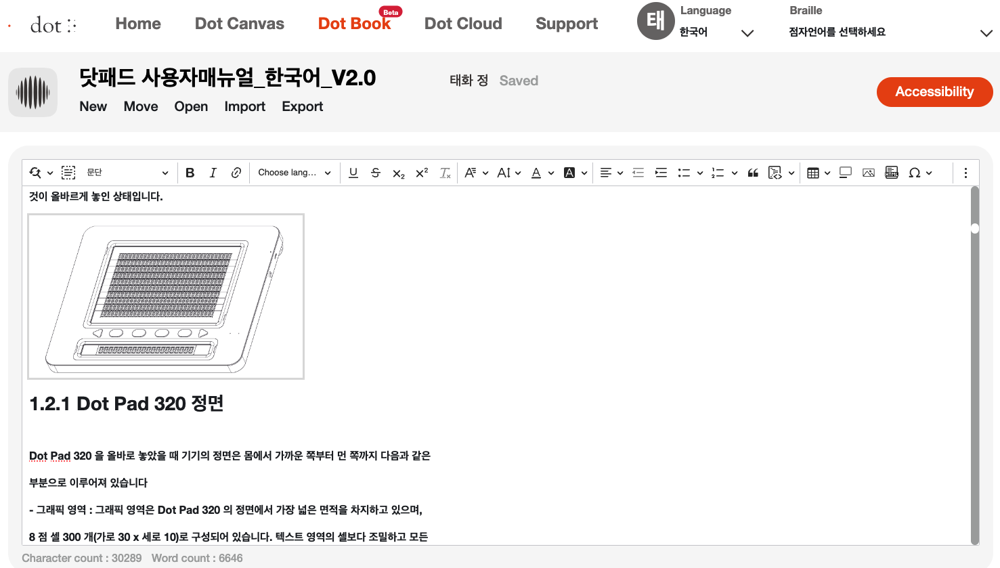
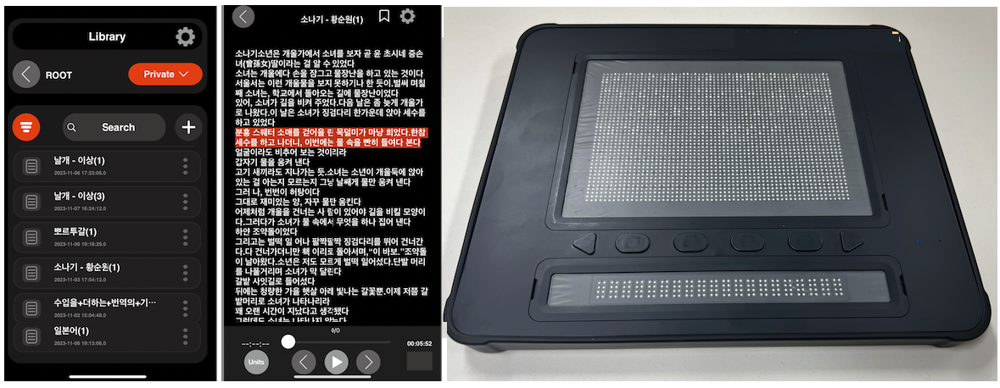

# Dot Book

## Directory
```
├── Dot Book Reader
└── Dot Book Editor
```

## Purpose  
- Dot Book was created to assist visually impaired individuals in easily accessing various types of documents.  
- It allows users to listen to the contents of documents in audio format and also output them through a Braille display (multi-line Braille terminal).
- Dot Book offers multi-line output capabilities through a Braille display, making it a potential replacement for Braille books.

## Key Features
- Dot Book provides an editor (web version) for creating documents and a reader (iOS mobile version) for reading documents.
- Dot Book supports various document formats, including WORD, PDF, HTML, DAISY, BRF, and BRL.
- Dot Book assists in improving the accessibility of documents for visually impaired individuals through an accessibility checker.
- Dot Book allows the contents of documents to be heard through VoiceOver and TTS (Text-to-Speech).
- Dot Book offers an experience of reading Braille books through a Braille display (multi-line Braille terminal).

## Main Functions
#### Dot Book Editor
- Document Creation: It is possible to create documents by converting PDF and WORD files.
- Accessibility Check: Provides a feature to check and modify accessibility during document creation.
- Export: Documents can be converted into formats like HTML and DAISY.
- Cloud: Documents can be saved in a personal storage space.

#### Dot Book Reader
- Open Document: Allows users to open documents stored locally or in the cloud.
- Read Document: Enables users to listen to the contents of the document using VoiceOver and TTS.
- Unit of Navigation: Provides the ability to navigate through the document by page, paragraph, or sentence while reading.
- Braille Display Output: Outputs document contents such as text, images, and tables in multi-line format to a Braille display.
- Current Location Indicator: Displays the current location being heard through the Braille display cursor.

## Main Screens
#### Dot Book Editor


#### Dot Book Reader
