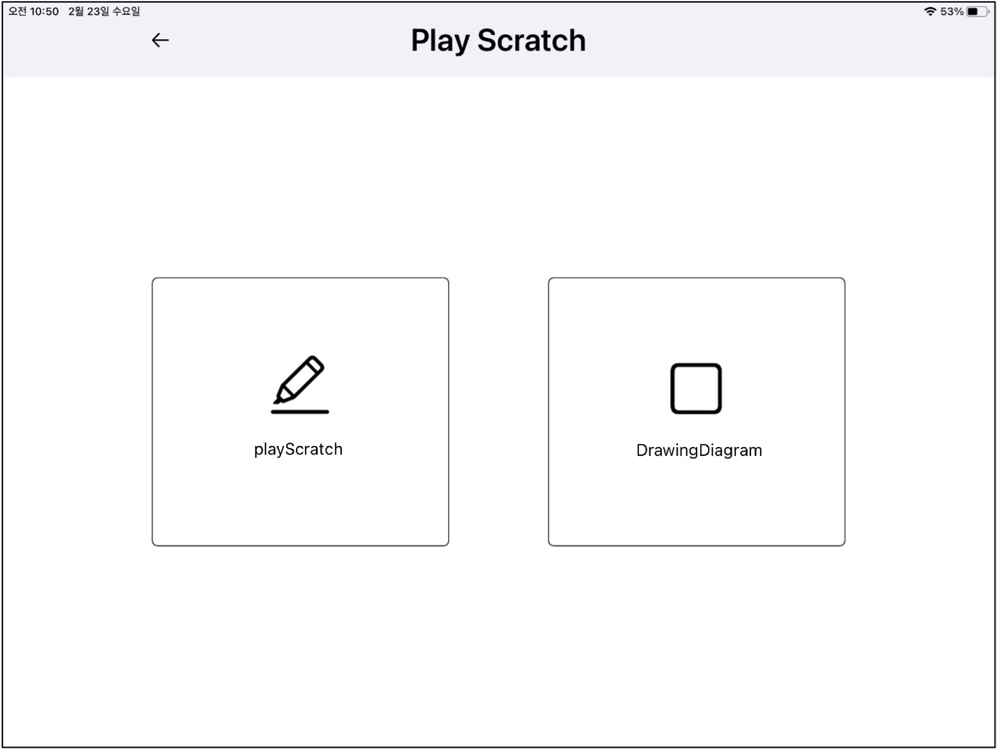
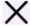
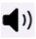

# Dot Canvas Web

## About

A tool to create image-based content

## Channel

The Dot Canvas app is currently available for download using TestFlight. Please fill out this form to gain access to Dot Canvas.

1. Download TestFlight from the App store
2. Fill out the [Dot Canvas Access Request Form](https://forms.gle/kaw1ixg3YN34n8xdA)
3. Receive a link to download Dot Canvas through email

## Manual

### 1. Device Search View

   
This searches for Dot Pad devices nearby and displays their names and RSSI.   
If a name is clicked, the app will connect with the selected device.

### 2. Device Control View

   
This is the first view that the user encounters.
- Play Scratch Button: moves to a view where users can trace shapes and compare their tactile drawing to the shape.
- Drawing Button: moves to a view where users can draw freely and print their output to the Dot Pad. Users can also print desired text as Braille. Drawings can be saved and printed or edited using the Gallery.
- Gallery Button: moves to a view where users can edit saved images on the host device and print to the Dot Pad.
- Online Gallery Button: moves to a view where users can call saved images from the server and print on the Dot Pad.
- Setting Button: moves to a view where users can disconnect the Dot Pad.

### 3. Setting View

   
This is a view where users can disconnect the Dot Pad.   
After disconnecting, the app returns to the Bluetooth connection screen.
- Close Button: returns to the previous screen, which is the Device Control View

### 4. Play Scratch View - 1

   
- PlayScratch Button: moves to a view where users can trace shapes such as Line, RightAngle, RightAngleTriangle, and Square.
- DrawingDiagram Button: moves to a view where users can drag to draw Square, Triangle, and Circle.
- Back Button: returns to the previous screen, which is the Device Control View

### 5. Play Scratch View - 2

   
The user can select a desired shape.
-  Back Button: returns to the previous screen
-  Close Button: moves to the Device Control View

### 6. Play Scratch View - 3

   
The user can draw the desired shape on the host device.   
The following buttons help with the process:
-  Undo Button: reverts the last change done in the drawing
-  Print Button: displays the current drawing onto the Dot Pad
-  Sample Print Button: displays the user's selected sample shape onto the Dot Pad
-  Compare Button: compares the sample shape and user's drawing
-  Clear All Button: erases the entire drawing
-  Speaker Button: produces an audio description of the sample shape
-  Close Button: returns to the previous screen

### 7. Compare View

   
The user can compare their drawing and the sample shape.
-  Back Button: returns to the previous screen

### 8. Diagram View - 1

   
The user can select a desired shape to draw.   
For example, if the Square button is selected, an audio description of a square will play and the screen will move to one where the user can draw a square.
-  Back Button: returns to the previous screen
-  Close Button: moves to the Device Control View

### 9. Diagram View – 2

   
The user can use the drag feature to draw the selected shape automatically.
-  Undo Button: reverts the last change done in the drawing
-  Print Button: displays the current drawing onto the Dot Pad
-  Clear All Button: erases the entire shape
-  Speaker Button: produces an audio description of the shape
-  Close Button: returns to the previous screen

### 10. Drawing View

   
The user can draw freely.
-  Undo Button: reverts the last change done in the drawing
-  Print Button: displays the current drawing onto the Dot Pad
-  Clear All Button: erases the entire drawing
-  Pencil Button: allows user to draw on the Canvas using lines
-  Square Button: allows user to use drag to produce squares on the Canvas
-  Triangle Button: allows user to use drag to produce triangles on the Canvas
-  Circle Button: allows user to use drag to produce circles on the Canvas
-  Text Button: prints user's text input as Braille on the Dot Pad text area
-  Speaker Button: reads the user's text input out loud
-  Save Button: saves the drawing to the host device
-  Close Button: returns to the previous screen, which is the Device Control View

### 11. Gallery View

   
The user can access images saved on the host device.   
Once an image is selected, the Edit and Print buttons allow for editing within the Drawing View and displaying of the image on the Dot Pad, respectively.
- Back Button: returns to the previous screen, which is the Device Control View
- Next Button: moves to the next page if there are more than 12 images in the Gallery View
- Previous Button: returns to the previous page

### 12. Online Gallery View

   
The user can call saved images from the server to print to the Dot Pad.
- Back Button: returns to the previous screen, which is the Device Control View
- Next Button: moves to the next page if there are more than 12 images in the Online Gallery View.
- Previous Button: returns to the previous page
