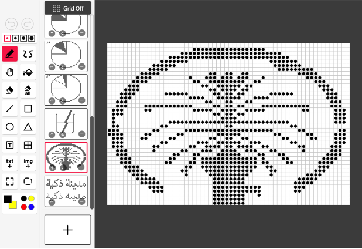
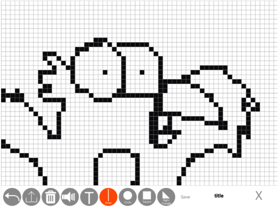

# Dot Canvas

## directory
```
├── Dot Canvas App
└── Dot Canvas Web
```

## Key Features
- Dot Canvas is an application designed for creating content to output tactile and Braille on DotPad. The created content files include tactile image data for displaying 300 cells on DotPad and Braille data for displaying 20 cells.

- Dot Canvas offers two versions: a mobile Dot Canvas App for visually impaired users to create tactile images independently and a PC Dot Canvas Web version for collaborators such as parents and teachers, considering users' accessibility needs.

- The mobile Dot Canvas App is developed with accessibility in mind, allowing visually impaired users to create tactile images without third-party assistance. Users can access menus using screen readers and draw in freeform or utilize pre-made shapes for easier drawing.

- Collaborators like parents and teachers can use various drawing tools in the PC Dot Canvas Web version to create tactile images. The created content is stored in Dot Cloud and can be loaded by visually impaired users using the Dot Canvas App.

- The PC Dot Canvas Web version provides tactile image conversion capabilities, allowing users to upload an image for conversion into tactile images. Users can modify the converted images as needed, making it easier to create desired tactile images.

- Users can share their created content files for others to utilize, and they can also use content shared by others. With an active cloud ecosystem for content sharing, accessing a wide range of content is expected to become more accessible and convenient.

- DotPad can be connected via Bluetooth or USB, allowing for single or multi-device connections. Multiple DotPad connections are useful for teachers conducting lessons with multiple students.

## Min Screen
#### Dot Canvas Web


### Dot Canvas App

