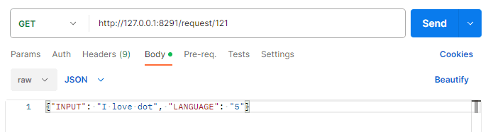

# Dot Middleware for Kiosk (version 3.0.1)

## Middleware program
- Run program
   
   
## REST API
### print to a 300 cell device
- API information : <a href="sample.dtm">downlaod sample.dtm</a>  
  ```
    URL (POST) : http://127.0.0.1:8291/request/111
    Parameter(JSON) : {"DTM_FILE_PATH": "c:/sample.dtm"}
  ```

- Post Man  
  

### print to a 20 cell device  
- API information
  ```
    URL (POST) : http://127.0.0.1:8291/request/121
    Parameter(JSON) : {"INPUT": "I love dot", "LANGUAGE": "5"}

    *LANGUAGE : 1(Arabic), 3(Chinese Mandarin), 5(English), 6(French), 7(German), 8(Italian), 9(Japanese) 
                10(Korean), 11(Russian), 12(Spanish), 13(Vietnamese), 16(Czech), 17(Polish), 18(Norwegian)
  ```
 
- Post Man  
  


