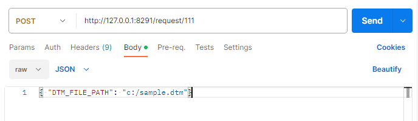
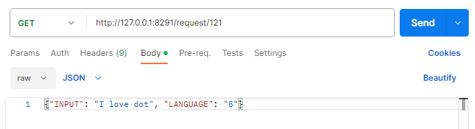

# Dot Middleware for Kiosk

## REST API
### print to a 300 cell device
- API information : <a href="sample.dtm">downlaod sample.dtm</a>  
  ```
    URL (POST) : http://127.0.0.1:8291/request/111
    Parameter(JSON) : {"DTM_FILE_PATH": "c:/sample.dtm"}
  ```

- Post Man  
  

### print to a 20 cell device  
- API information
  ```
    URL (POST) : http://127.0.0.1:8291/request/121
    Parameter(JSON) : {"INPUT": "I love dot", "LANGUAGE": "5"}

    * LANGUAGE (Dot Braille) : 1(Arabic), 3(Chinese), 5(English), 9(Japanese), 10(Korean)
    * LANGUAGE (Liblouis Braille) : 6(French), 7(German), 8(Italian), 11(Russian), 12(Spanish), 
        13(Vietnamese), 15(Portuguese), 16(Czech), 17(Polish), 18(Norwegian), 19(Kazakh), 20(Danish), 
        21(Greek), 22(Swedish), 23(Finnish), 24(Thai), 25(Uzbek)           
                
  ```
 
- Post Man  
  


