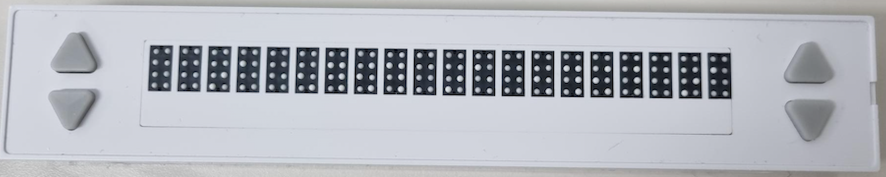
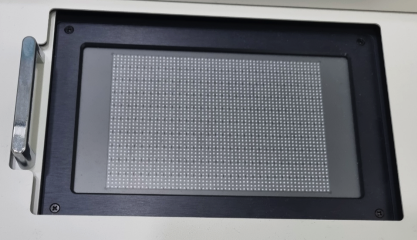
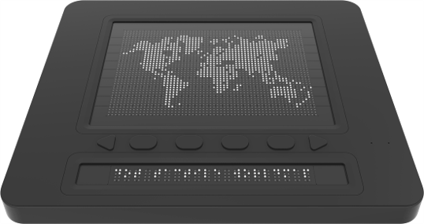
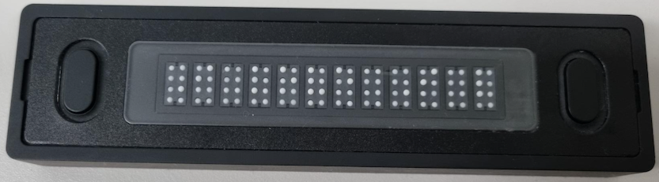
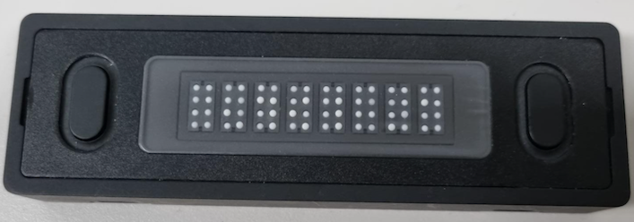

# Dot Middleware for Kiosk

## Download
#### Download by version
- 3.0.0 : <a href="https://github.com/dotincorp/dotpad-application/raw/refs/heads/main/Dot%20Middleware/Dot%20Middleware%20Kiosk/3.0.0/dot-middleware-kiosk-3.0.0.zip">download</a> (2023.04.11, KM2-20/KM2-300A) : Add administrator privileges at runtime
- 3.0.1 : <a href="https://github.com/dotincorp/dotpad-application/raw/refs/heads/main/Dot%20Middleware/Dot%20Middleware%20Kiosk/3.0.1/dot-middleware-kiosk-3.0.1.zip">download</a> (2023.10.25, KM2-20/KM2-300A) : Add a rest api
- 3.1.0 : <a href="https://github.com/dotincorp/dotpad-application/raw/refs/heads/main/Dot%20Middleware/Dot%20Middleware%20Kiosk/3.1.0/dot-middleware-kiosk-3.1.0.zip">download</a> (2023.11.15, KM2-20/KM2-300A) : Add liblouis braille engine.
- 3.4.1 : <a href="https://github.com/dotincorp/dotpad-application/raw/refs/heads/main/Dot%20Middleware/Dot%20Middleware%20Kiosk/3.4.1/dot-middleware-kiosk-3.4.1.zip">download</a> (2025.04.15, KM2-20/KM2-300A/DotPad320A/KM3-12A/KM3-08A) : Modify the config settings file
- 3.4.2 : <a href="https://github.com/dotincorp/dotpad-application/raw/refs/heads/main/Dot%20Middleware/Dot%20Middleware%20Kiosk/3.4.2/dot-middleware-kiosk-3.4.2.zip">download</a> (2025.06.18, KM2-20/KM2-300A/DotPad320A/KM3-12A/KM3-08A/KM3-40A) : Add KM3-40A Device
<!-- TODO: 아래 버전 버그 수정 후 반영 예정 
- 3.2.0 : <a href="3.2.0/dot-middleware-kiosk-3.2.0.zip">download</a> (2023.11.15) : Add DotPad320 device
- 3.3.0 : <a href="3.3.0/dot-middleware-kiosk-3.3.0.zip">download</a> (2024.09.26) : Add KM3-12A device
- 3.4.0 : <a href="3.4.0/dot-middleware-kiosk-3.4.0.zip">download</a> (2024.12.23) : Add KM3-08A device
- 3.4.2 : <a href="3.4.2/dot-middleware-kiosk-3.4.2.zip">download</a> (2025.06.18) : Add KM3-40A device
-->

 ## Kiosk Devices
  - KM2-20
  

  - KM2-300A
  

  - DotPad320A
  

  - KM3-12A
  

  - KM3-08A
  
