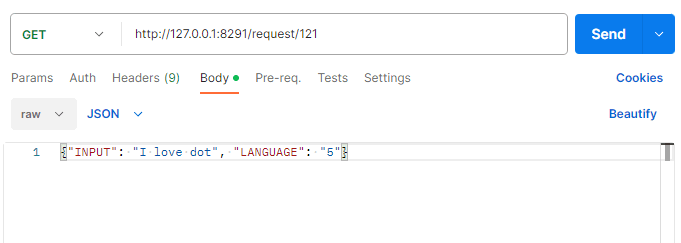

# Dot Middleware for Kiosk

## Download Link
- 3.0.1 : <a href="dot-middleware-kiosk-3.0.1.zip">download</a> (2023.10.25) : Add a rest api
- 3.0.0 : <a href="dot-middleware-kiosk-3.0.0.zip">download</a> (2023.04.11) : Add administrator privileges at runtime

## How to download
 - Click the link for the file version you want to download.  
 - Click the Download button.  
   

 ## Kiosk Elements
 

    
Middleware program
  
    <pre>
      
    </pre>
  

  

    
300 cell device
  
    <pre>
      
    </pre>
  

  

    
20 cell device
  
    <pre>
      
    </pre>
  

## REST API usage guide
  

    
API to print to a 300-cell device
  
    <pre>
       <li> api </li>
       <a href="sample.dtm">downlaod sample.dtm</a>
       <code>
         URL (POST) : http://127.0.0.1:8291/request/111
         Parameter(JSON) : {"DTM_FILE_PATH": "D:/Data/dtm/ample.dtm"} 
        </code>
      <li>post-man</li>
      
    </pre>
    
  

  

    
API to print to a 20-cell device
  
    <pre><code>
      URL (POST) : http://127.0.0.1:8291/request/111
      Parameter(JSON) : {"DTM_FILE_PATH": "D:/Data/dtm/1_1_A.dtm"} 
    </code></pre>
    
  

