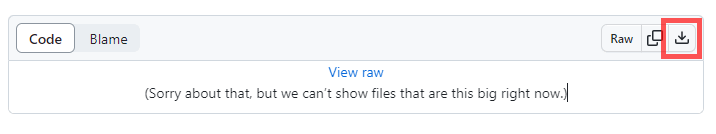
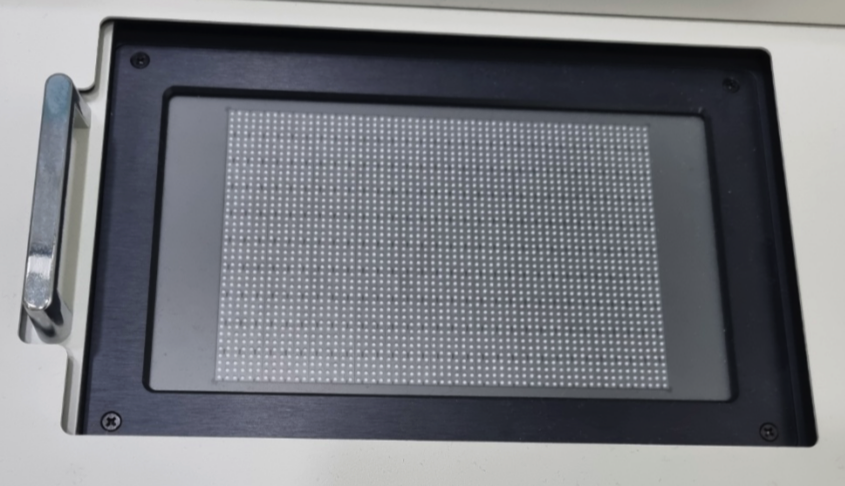
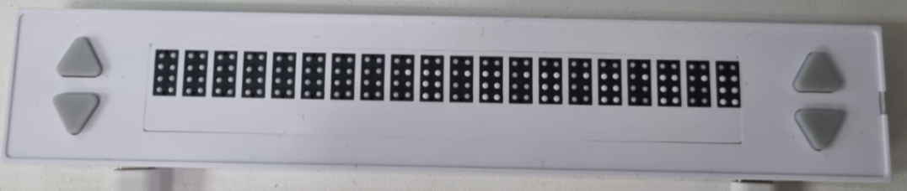

# Dot Middleware for Kiosk

## Download
#### Download by version
- 3.0.0 : <a href="3.0.0/dot-middleware-kiosk-3.0.0.zip">download</a> (2023.04.11) : Add administrator privileges at runtime
- 3.0.1 : <a href="3.0.1/dot-middleware-kiosk-3.0.1.zip">download</a> (2023.10.25) : Add a rest api
- 3.1.0 : <a href="3.1.0/dot-middleware-kiosk-3.1.0.zip">download</a> (2023.11.15) : Add liblouis braille engine
- 3.2.0 : <a href="3.2.0/dot-middleware-kiosk-3.2.0.zip">download</a> (2023.11.15) : Add DotPad320 device
- 3.3.0 : <a href="3.3.0/dot-middleware-kiosk-3.3.0.zip">download</a> (2024.09.26) : Add KM3-12A device
- 3.4.0 : <a href="3.4.0/dot-middleware-kiosk-3.4.0.zip">download</a> (2024.12.23) : Add KM3-08A device

#### How to download
 - Click the link for the file version you want to download.  
 - Click the Download button.  
   

 ## Kiosk Elements
  300 cell device  
  

- 20 cell device  
  
