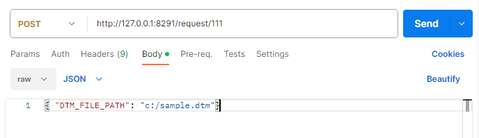

# Dot Middleware for Kiosk

## Download
#### Download by version
- 3.0.1 : <a href="dot-middleware-kiosk-3.0.1.zip">download</a> (2023.10.25) : Add a rest api
- 3.0.0 : <a href="dot-middleware-kiosk-3.0.0.zip">download</a> (2023.04.11) : Add administrator privileges at runtime

#### How to download
 - Click the link for the file version you want to download.  
 - Click the Download button.  
   

 ## Kiosk Elements
 - Middleware program
   

- 300 cell device  
  

- 20 cell device  
  

## REST API usage guide
### print to a 300 cell device
- API information : <a href="sample.dtm">downlaod sample.dtm</a>  
  ```
    URL (POST) : http://127.0.0.1:8291/request/111
    Parameter(JSON) : {"DTM_FILE_PATH": "D:/Data/dtm/ample.dtm"}
  ```

- Post Man  
  

### print to a 20 cell device  
- API information
  <a href="sample.dtm">downlaod sample.dtm</a>
  ```
    URL (POST) : http://127.0.0.1:8291/request/111
    Parameter(JSON) : {"DTM_FILE_PATH": "D:/Data/dtm/ample.dtm"}
  ```

- Post Man  
  


