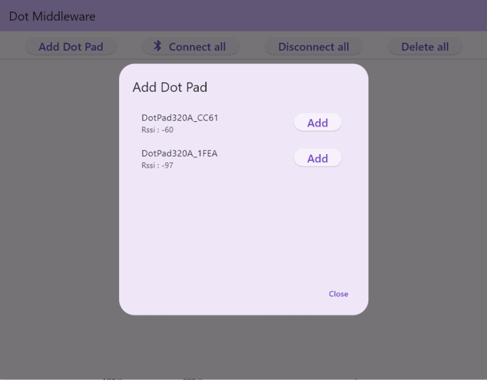
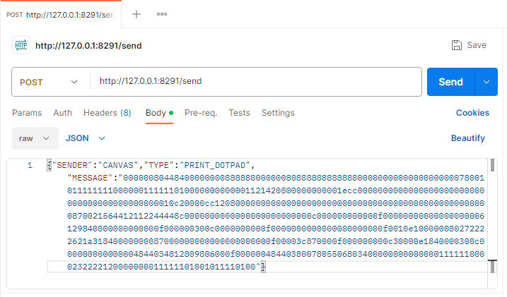

# Dot Middleware User

## Download
- 1.0.2-beta <a href="dot-middleware-user-1.0.2-beta.zip">download</a> (2023.10.19) : Added http server method
- 1.0.1-beta <a href="dot-middleware-user-1.0.1-beta.zip">download</a> (2023.10.01) : Modified device status management
- 1.0.0-beta <a href="dot-middleware-user-1.0.0-beta.zip">download</a> (2023.09.26) : First version added

## How to Download
 - Click the link for the file version you want to download.  
 - Click the Download button.  
   

  
## User Manual
  <details>
    <summary>Scan Dot Pad</summary>
      
  </details>

## API usage
  <details>
    <summary> Tactile data Dot Pad print API</summary>  
    ```
      URL (POST) : http://127.0.0.1:8291/send
      Parameter(JSON) : {"SENDER":"CANVAS","TYPE":"PRINT_DOTPAD","MESSAGE":"Tactile hex data to be printed on 300 cells"}
      
  </details>
  ```
  - Dot Pad print  
    