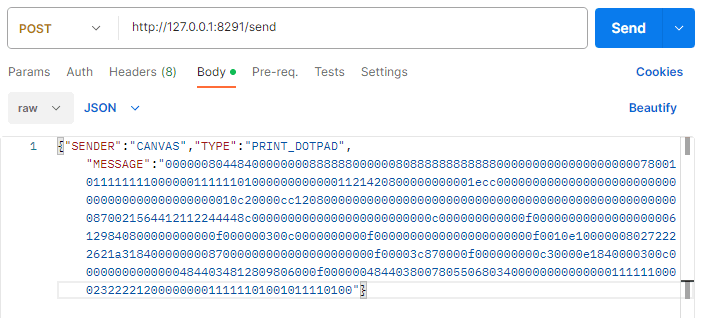
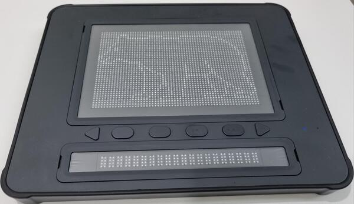

# Dot Middleware User (Windows)

## Download Link
- 1.0.3-beta <a href="https://github.com/dotincorp/dotpad-application/raw/refs/heads/main/Dot%20Middleware/Dot%20Middleware%20User/Windows/dot-middleware-user-1.0.3-beta.exe">download</a> (2025.04.18) : Fixed instability in Dotpad connection/reconnection

## API usage
  

    
Dot Pad print API
  
    <pre><code>
      URL (POST) : http://127.0.0.1:8291/send
      Parameter(JSON) : {"SENDER":"CANVAS","TYPE":"PRINT_DOTPAD","MESSAGE":"Tactile hex data to be printed on 300 cells"}  
    </code></pre>
    
  

  
  

    
Dot Pad print  
  
    
  
    
