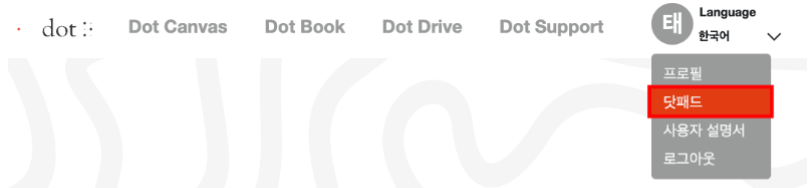

# DotPad Emulator

## Overview
- The DotPad emulator is created to allow developers to test and develop without the need for actual DotPad hardware devices.
- You can develop DotPad programs using the DotPad SDK and then connect to the DotPad emulator to test and output them.
- Developer <a href="https://apps.apple.com/us/developer/yueyu-zhao/id1689319351">Yueyu Zhao</a> contributed to the development of the dotpad emulator.

## How to Use
1. Install the DotPad emulator from the app store.  
<a href="https://apps.apple.com/us/app/bluetooth-simulator/id6468956150">DotPad emulator App Store shortcut</a>  
  
2. Run the DotPad emulator.  
  
3. Connect to Dot Canvas Web and establish a connection with DotPad emulator.  
  
4. Select the DotPad emulator and establish a connection.  
  
5. Output through the DotPad emulator  
  